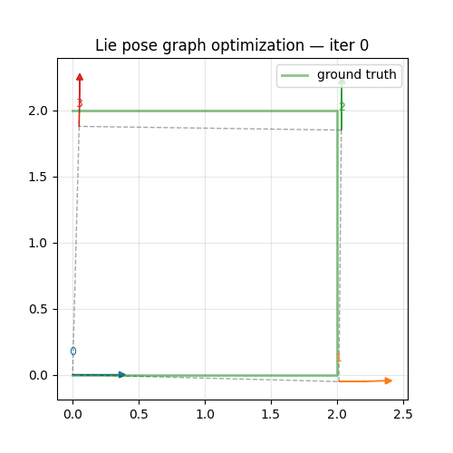
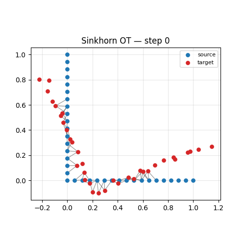
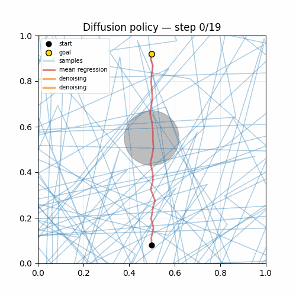

# RobotMath2030

**RobotMath2030 is an executable visual guide to the mathematics behind future robotics, Physical AI, world models, and humanoids.**

Not a textbook. Not a paper reimplementation repo.
Learn **why** the math appears in robot maps, poses, policies, contact, and world models — with tiny Python code and interactive visualizations.

> Read this **after** [PythonRobotics](https://github.com/AtsushiSakai/PythonRobotics), **before** GTSAM / Ceres / LeRobot production stacks.

[日本語 README](README_ja.md)

## Demos at a glance

| Lie pose graph | Sinkhorn point clouds | Multimodal actions |
|:--:|:--:|:--:|
|  |  |  |
| Ch.02 — SE(2) SLAM | Ch.05 — optimal transport | Ch.07 — diffusion policy |

Regenerate GIFs: `pip install -e ".[torch]" && python scripts/render_all_gifs.py`

## Why RobotMath2030?

When you read robotics papers you keep hitting terms like:

`Wasserstein distance` · `SE(3)-equivariant policy` · `score-based policy` · `latent world model` · `differentiable contact` · `manifold optimization`

Standard math courses teach definitions. They rarely explain **which robot situation** forces that math — or **what breaks** when you treat pose as a Euclidean vector.

RobotMath2030 fills that gap:

```
math definition  →  minimal runnable code  →  robotics context  →  failure cases
```

## All 10 chapters

**MVP complete** — full guide: [docs/chapters.md](docs/chapters.md) · machine index: [docs/concept_index.yaml](docs/concept_index.yaml)

| Chapter | What you learn |
|---------|----------------|
| [01 — Pose is not a vector](chapters/01_pose_is_not_vector/) | SE(2) composition, exp/log, Euler-angle failure |
| [02 — Tiny Lie graph optimizer](chapters/02_tiny_lie_graph_optimizer/) | Pose graph SLAM in ~50 lines; Euclidean vs Lie residuals |
| [03 — Retraction vs projection](chapters/03_retraction_vs_projection/) | Landmark pose on SE(2); exp update vs additive (x,y,θ) |
| [04 — Riemannian motion policy](chapters/04_riemannian_motion_policy/) | Task metrics fused; naive APF sum vs RMP detour |
| [05 — Sinkhorn for point clouds](chapters/05_sinkhorn_point_clouds/) | Soft correspondence for maps and scans; OT vs naive matching |
| [06 — Wasserstein map evaluation](chapters/06_wasserstein_map_evaluation/) | Map drift / ghost obstacles; L2 grid MSE vs W2 |
| [07 — Diffusion policy 2D](chapters/07_diffusion_policy_2d/) | Multimodal trajectories; mean regression vs diffusion |
| [08 — Flow matching vs diffusion](chapters/08_flow_matching_vs_diffusion/) | Same task; velocity field vs denoising; fewer ODE steps |
| [09 — Differentiable physics](chapters/09_differentiable_physics/) | Mass-spring ID; hard contact breaks gradients |
| [10 — Tiny world model](chapters/10_tiny_world_model/) | Latent dynamics + imagination MPC; open-loop drift |
| [11 — Information geometry](chapters/11_information_geometry/) | Fisher metric; natural vs Euclidean gradient on Gaussian policy |
| [12 — SE(3)-equivariant preview](chapters/12_se3_equivariant_preview/) | Point cloud vector readout; rotation breaks naive MLP |
| [13 — Neural operators](chapters/13_neural_operators/) | DeepONet mass-spring operator; amortized rollout vs integrator |

```bash
pip install -e ".[torch]"
python scripts/smoke_all_chapters.py   # headless check all demos
```

## Colab notebooks

| Notebook | Topic |
|----------|-------|
| [01_geometry_of_state](notebooks/01_geometry_of_state.ipynb) | SE(2) + pose graph |
| [05_sinkhorn_optimal_transport](notebooks/05_sinkhorn_optimal_transport.ipynb) | Entropic OT |
| [07_diffusion_policy](notebooks/07_diffusion_policy.ipynb) | Multimodal trajectories |

Open in Colab: `https://colab.research.google.com/github/rsasaki0109/RobotMath2030/blob/main/notebooks/01_geometry_of_state.ipynb`

## 3-month roadmap

```
Month 1  Geometry of State      Lie groups · pose graphs · manifold optimization
Month 2  Geometry of Distribution  Sinkhorn OT · diffusion · natural gradient
Month 3  Geometry of Dynamics     Differentiable physics · tiny world model
```

See [docs/roadmap.md](docs/roadmap.md) for the full plan.

**Docs site:** [rsasaki0109.github.io/RobotMath2030](https://rsasaki0109.github.io/RobotMath2030/) · build locally: `pip install -e ".[docs]" && python scripts/sync_chapter_docs.py && mkdocs serve`

## Repository structure

```
robotmath/     Tiny reference implementations (Lie, OT, diffusion, …)
chapters/      Runnable lessons with concept.yaml metadata
miniworlds/    Synthetic worlds for demos
notebooks/     Colab quick-start notebooks (3)
docs/          Concept maps, chapter guide, roadmap
benchmarks/    Smoke-test notes
tests/         Math property tests
```

## Install

```bash
git clone https://github.com/rsasaki0109/RobotMath2030.git
cd RobotMath2030
pip install -e ".[dev]"
pytest
```

Core dependencies: **NumPy**, **Matplotlib**. **PyTorch** is required for Ch.07+ (`pip install -e ".[torch]"`).

## Positioning

| Project | Role |
|---------|------|
| PythonRobotics | Classical robotics algorithms in Python |
| **RobotMath2030** | **Math OS for reading future robotics papers** |
| GTSAM / Ceres / Sophus | Production geometry & optimization |
| LeRobot | Robot learning models, data, tools |

## License

MIT — see [LICENSE](LICENSE).
