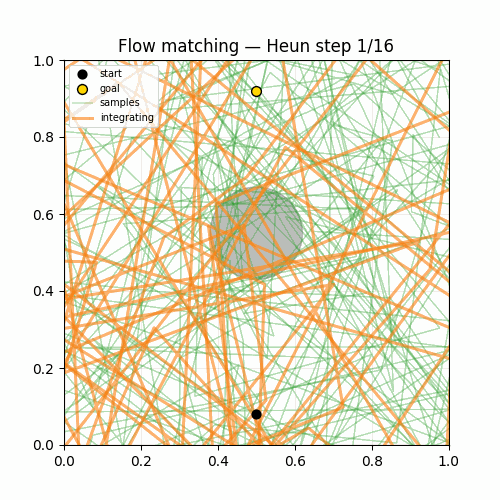
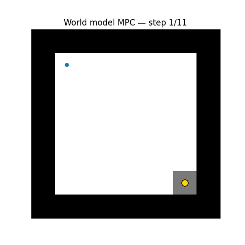
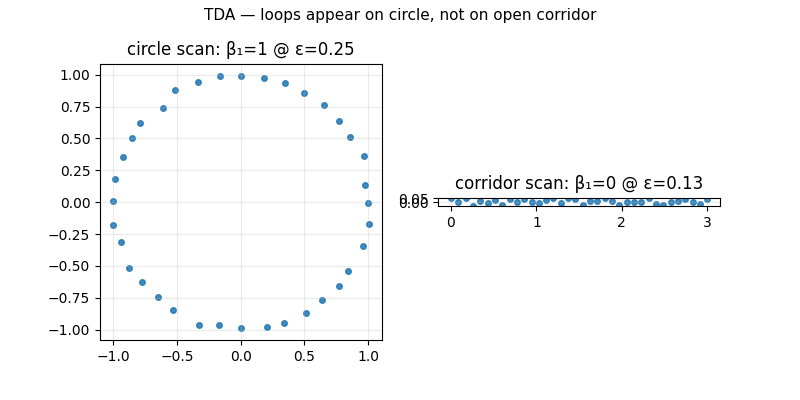

# 15 Tiny Math Engines

**RobotMath2030** is an executable visual guide to the mathematics behind future robotics, Physical AI, world models, and humanoids.

Read this **after** [PythonRobotics](https://github.com/AtsushiSakai/PythonRobotics), **before** GTSAM / Ceres / LeRobot production stacks.

```
math definition  →  minimal runnable code  →  robotics context  →  failure cases
```

---

## Demos at a glance

| Pose graph SLAM | Sinkhorn OT | Diffusion policy |
|:--:|:--:|:--:|
|  |  |  |
| Ch.02 | Ch.05 | Ch.07 |

| Flow matching | World model MPC | TDA loop detection |
|:--:|:--:|:--:|
|  |  |  |
| Ch.08 | Ch.10 | Ch.14 |

Regenerate: `pip install -e ".[torch]" && python scripts/render_all_gifs.py`

---

## Three pillars · 15 chapters

### Geometry of State

Lie groups, pose graphs, manifold optimization, RMPs.

| | Chapter | Run locally |
|---|---------|-------------|
| 01 | [Pose is not a vector](chapters/01_pose_is_not_vector.md) | `python chapters/01_pose_is_not_vector/demo.py` |
| 02 | [Tiny Lie graph optimizer](chapters/02_tiny_lie_graph_optimizer.md) | `python chapters/02_tiny_lie_graph_optimizer/demo.py` |
| 03 | [Retraction vs projection](chapters/03_retraction_vs_projection.md) | `python chapters/03_retraction_vs_projection/demo.py` |
| 04 | [Riemannian motion policy](chapters/04_riemannian_motion_policy.md) | `python chapters/04_riemannian_motion_policy/demo.py` |

### Geometry of Distribution

Optimal transport, diffusion / flow matching, information geometry, equivariance, topology.

| | Chapter | Run locally |
|---|---------|-------------|
| 05 | [Sinkhorn for point clouds](chapters/05_sinkhorn_point_clouds.md) | `python chapters/05_sinkhorn_point_clouds/demo.py` |
| 06 | [Wasserstein map evaluation](chapters/06_wasserstein_map_evaluation.md) | `python chapters/06_wasserstein_map_evaluation/demo.py` |
| 07 | [Diffusion policy 2D](chapters/07_diffusion_policy_2d.md) | `python chapters/07_diffusion_policy_2d/demo.py` |
| 08 | [Flow matching vs diffusion](chapters/08_flow_matching_vs_diffusion.md) | `python chapters/08_flow_matching_vs_diffusion/demo.py` |
| 11 | [Information geometry](chapters/11_information_geometry.md) | `python chapters/11_information_geometry/demo.py` |
| 12 | [SE(3)-equivariant preview](chapters/12_se3_equivariant_preview.md) | `python chapters/12_se3_equivariant_preview/demo.py` |
| 14 | [Topology / TDA](chapters/14_topology_tda.md) | `python chapters/14_topology_tda/demo.py` |

### Geometry of Dynamics

Differentiable physics, world models, neural operators.

| | Chapter | Run locally |
|---|---------|-------------|
| 09 | [Differentiable physics](chapters/09_differentiable_physics.md) | `python chapters/09_differentiable_physics/demo.py` |
| 10 | [Tiny world model + planning](chapters/10_tiny_world_model.md) | `python chapters/10_tiny_world_model/demo.py` |
| 13 | [Neural operators (DeepONet)](chapters/13_neural_operators.md) | `python chapters/13_neural_operators/demo.py` |
| 15 | [FNO vs DeepONet](chapters/15_fourier_neural_operator.md) | `python chapters/15_fourier_neural_operator/demo.py` |

Full index: [Chapter guide](chapters.md) · [concept_index.yaml](concept_index.yaml)

---

## Colab quick start (6 notebooks)

| Notebook | Topic |
|----------|-------|
| [01 — Geometry of State](https://colab.research.google.com/github/rsasaki0109/RobotMath2030/blob/main/notebooks/01_geometry_of_state.ipynb) | SE(2) + pose graph |
| [05 — Sinkhorn OT](https://colab.research.google.com/github/rsasaki0109/RobotMath2030/blob/main/notebooks/05_sinkhorn_optimal_transport.ipynb) | Entropic OT |
| [07 — Diffusion policy](https://colab.research.google.com/github/rsasaki0109/RobotMath2030/blob/main/notebooks/07_diffusion_policy.ipynb) | Multimodal trajectories |
| [08 — Flow matching](https://colab.research.google.com/github/rsasaki0109/RobotMath2030/blob/main/notebooks/08_flow_matching.ipynb) | Flow vs diffusion |
| [10 — World model](https://colab.research.google.com/github/rsasaki0109/RobotMath2030/blob/main/notebooks/10_world_model.ipynb) | Latent dynamics + MPC |
| [13 — Neural operators](https://colab.research.google.com/github/rsasaki0109/RobotMath2030/blob/main/notebooks/13_neural_operators.ipynb) | DeepONet operator |

---

## Install & verify

```bash
git clone https://github.com/rsasaki0109/RobotMath2030.git
cd RobotMath2030
pip install -e ".[all]"
pytest -q
python scripts/smoke_all_chapters.py
python benchmarks/run_benchmarks.py
```

---

## Contribute

New chapters should follow **math → code → robotics → failure cases**. See [CONTRIBUTING.md](https://github.com/rsasaki0109/RobotMath2030/blob/main/CONTRIBUTING.md).

Good first issues: fix a failure-case demo, add a property test, improve a Colab notebook, or translate chapter README snippets to Japanese.

[GitHub repository](https://github.com/rsasaki0109/RobotMath2030) · [日本語 README](https://github.com/rsasaki0109/RobotMath2030/blob/main/README_ja.md)
